## WireLinx PLC Training Course [ Commissiong Concept ]

### Content
- #### LAB1 Ladder Logic Programming Concept ( 08:00 - 09:00 )
  - ##### 1.1 Study Machine Concept.
  - ##### 1.2 FlowChart Process Sequence. 
  - ##### 1.3 Pattern Ladder Logic Program.
  - ##### 1.4 Input File Program Commissioning.
  - ##### 1.5 Output File Program Commissioning.
  - ##### 1.6 Process File Program Commissioning.
  - ##### 1.7 Output Address Mapping.
  - ##### 1.8 Predictive Maintainence Concept.
- #### Guide PLC Memory address ( 10:20 - 11:00)
- #### LAB2 Application analog sensor ( 11:00 - 12:00 )
  - ##### 2.1 Digital and Analog Signal
  - ##### 2.2 Analog Digital Converter (ADC) with voltage.
  - ##### 2.3 Sensor Temperature and Humidity Convert.
  - ##### 2.4 Ladder Logic Compute Scaling Data.
- #### LAB3 Application Scada system with PLC ( 13:00 - 14:00 )
---
## LAB1 Ladder Logic Programming Concept ( 08:00 - 09:00 )
### 1.1 Study Machine Concept.


---
### 1.2 FlowChart Process Sequence. 
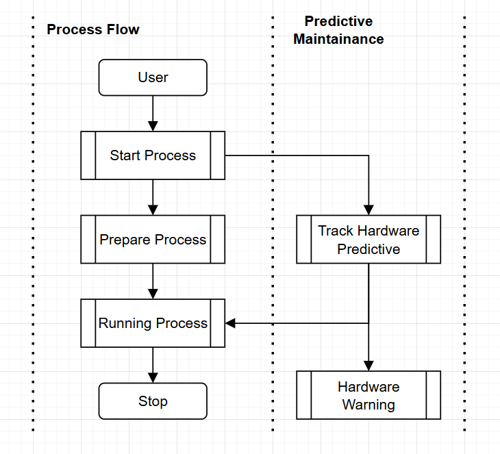

---
### 1.4 Input File Program Commissioning.
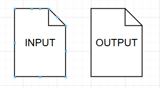
```
File:INPUT
```


---
### 1.5 Output File Program Commissioning.
```
File:OUTPUT
```


---
### 1.6 Process File Program Commissioning.
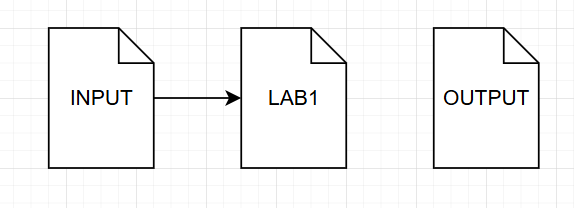
```
File:LAB1  
Section:Start Process 
```

```
File:LAB1  
Section:Prepare Machine Before Run
```

```
File:LAB1  
Section:Machine Running
```

```
File:LAB1  
Section:Process
```

```
File:LAB1  
Section:Counter And Stop Process
```


---
### 1.7 Output Address Mapping.
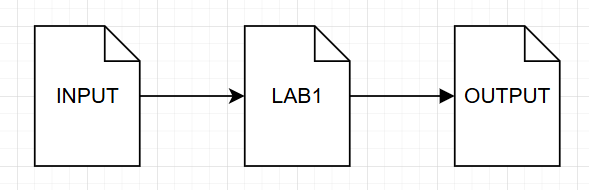
```
File:OUTPUT
```
 


---
### 1.8 Predictive Maintainence Concept.

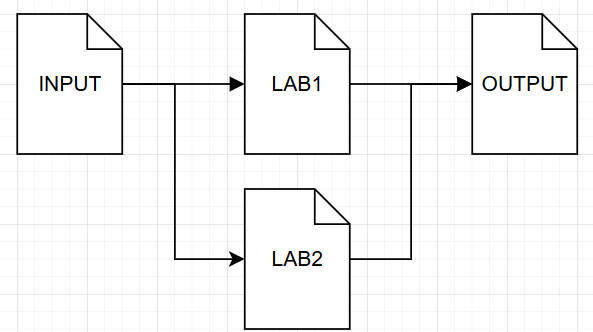
```
File:LAB2
Section Counter Hardware Running
```

```
File:LAB2
Section Counter Hardware All Reset
```

```
File:LAB2
Section Detect Cycle Hardware Maintain
```

```
File:OUTPUT
```


---
## Guide PLC Memory address ( 10:20 - 11:00)
- ### System Memory.
---

## LAB2 Application analog sensor ( 11:00 - 12:00 )
### 2.1 Digital and Analog Signal
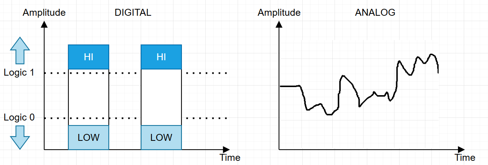

---
### 2.2 Analog Digital Converter (ADC) with voltage.
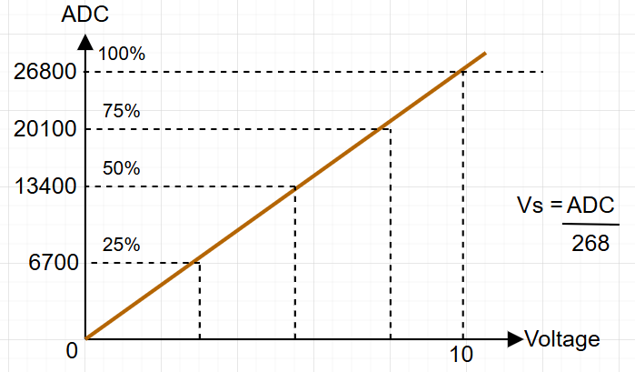

---
### 2.3 Sensor Temperature and Humidity Convert.
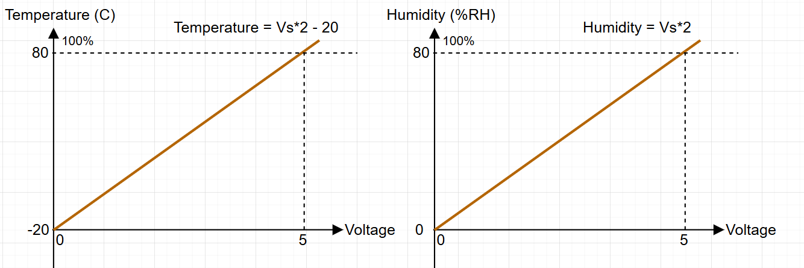

---

### 2.4 Ladder Logic Compute Scaling Data.
```
File:LAB21
```


---

## Application Scada system with PLC ( 13:00 - 14:00 )
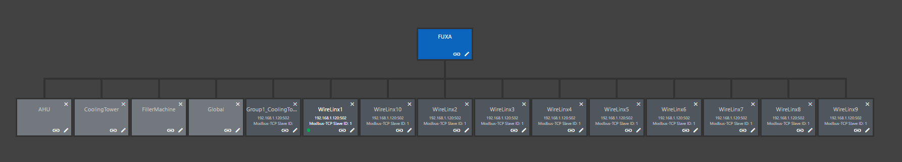
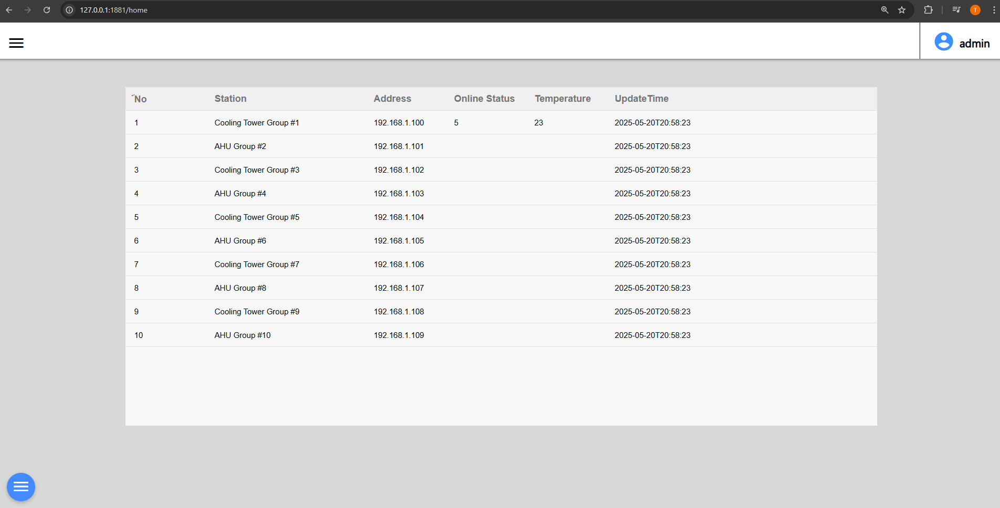
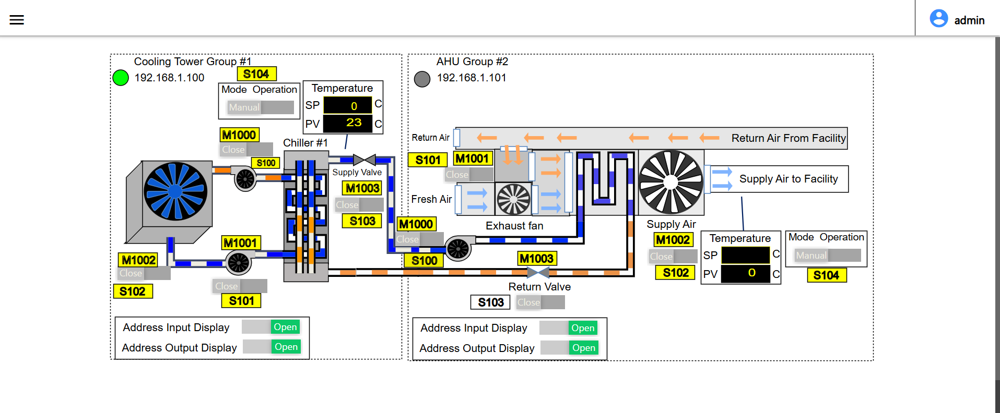
