## WireLinx PLC Training Course.

#### Content
- ##### Lab1 Basic Instruction Ladder Logic ( 08:00 - 09:00 )
    - Input/Output
      - Input Contact NO / NC / PULSE EDGE.
      - Output Coil / SET / RESET / ALT.
    - Timer And Counter.
    - Quiz Programming.
- ##### Lab2 Operation ( 09:00 - 10:00)
    - Math Operation
      - INC / DEC / ADD / SUB / MUL / DIV.
    - Data Operation
      - MOV.
    - Data Compare Operation.
      - AND= , AND<> , AND> , AND< , AND>= , AND<=.
- ##### Guide PLC Memory address ( 10:20 - 11:00)
    - Bit Memory X , Y , M , S.
    - Word Memory D.
    - System Memory D , M.
- ##### Lab3 How to use analog sensor with plc ( 11:00 - 12:00 )
    - Analog Data.
    - Sensor Temperature and Humidity Scale.
    - Quiz Programming.
- ##### Application Scada system with PLC ( 13:00 - 14:00 )
    - Intro Scada system
      - Supervisor.
      - Control.
      - Data Acquisition.
    - air condition.
      - Cooling Tower.
      - Chiler.
      - Air Handling Unit.
- ##### Lab4 Quiz final ( 14:00 - 17:00 )
---

- #### Lab1 Basic Instruction Ladder Logic ( 08:00 - 09:00 )
- #### Part1 => Prepare File Input. 
``` 
Quiz : 1.How does coil and contact symbol work ?  
       2.This program how to work. ?
```
```
File:INPUT
```
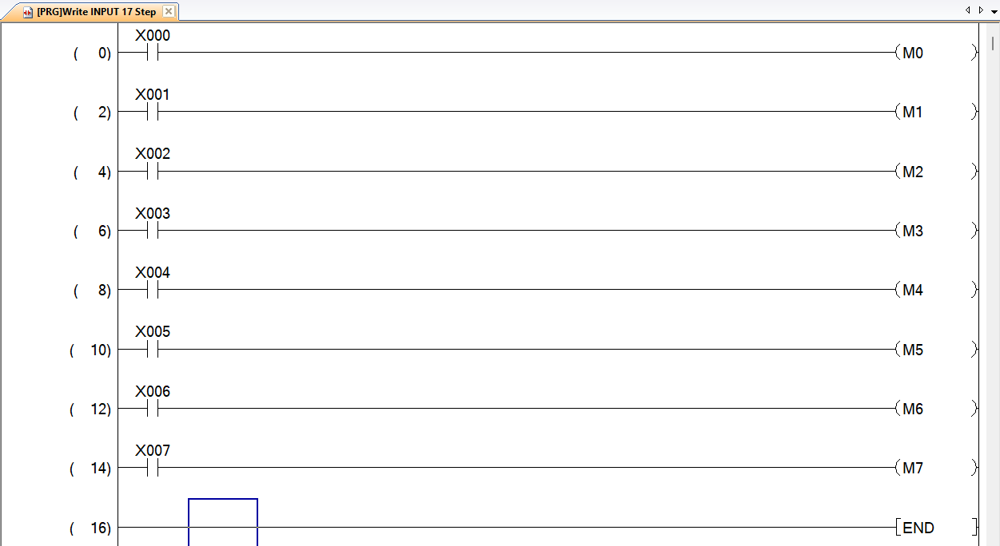
- #### Part2 => Prepare File Output.
```
File:OUTPUT
```
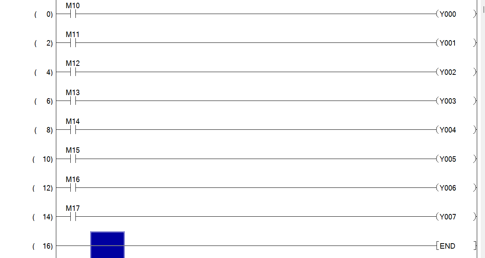
- #### Part3 => Condition Start Process.  
```
File:LAB1  
Section:Start Process 
```
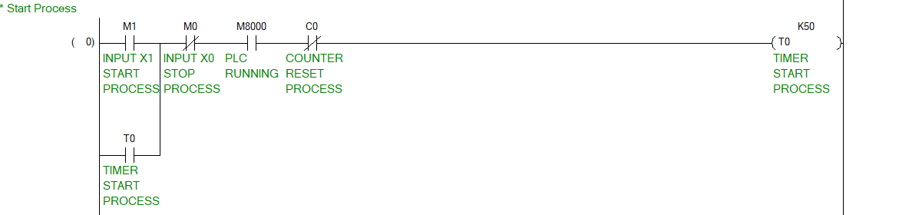
```
File:LAB1  
Section:Prepare Machine Before Run
```
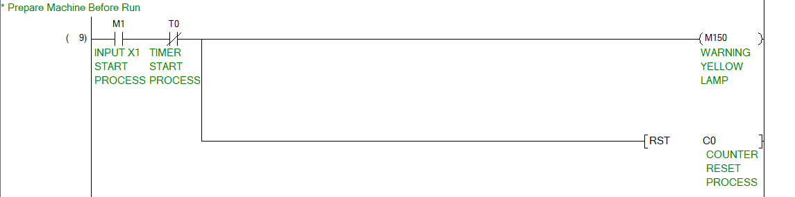
```
File:LAB1  
Section:Machine Running
```
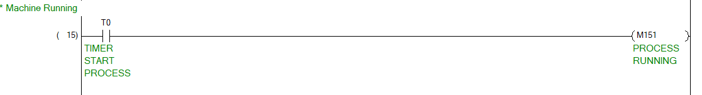
```
File:LAB1  
Section:Process
```
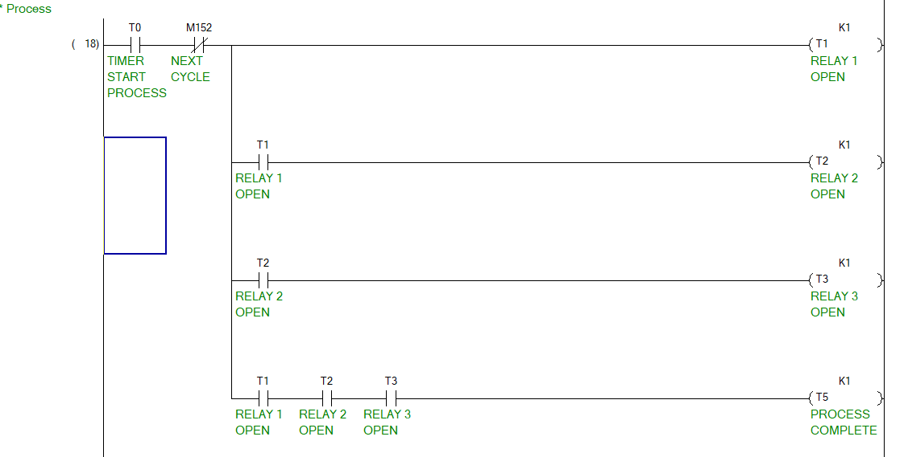
```
File:LAB1  
Section:Counter And Stop Process
```
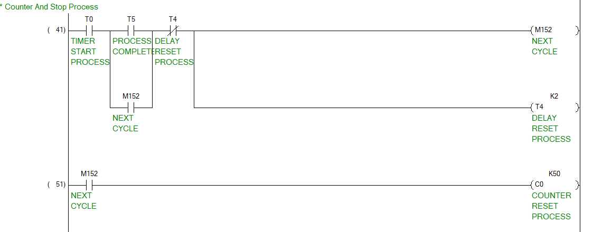
- #### Part4 => Mapping Process common with output. 
```
File:OUTPUT
```
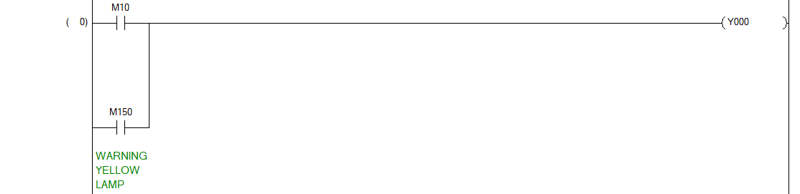 
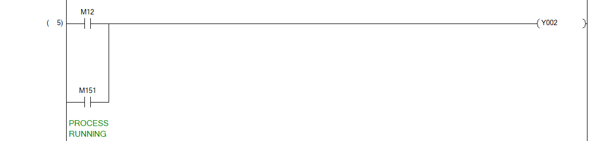
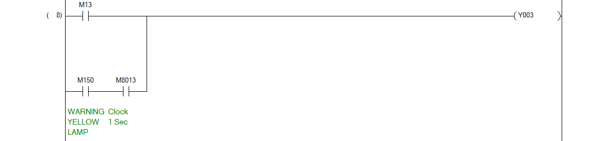
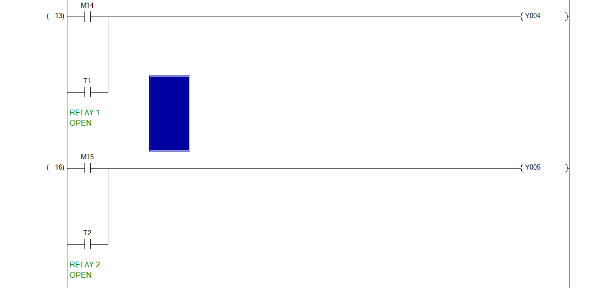
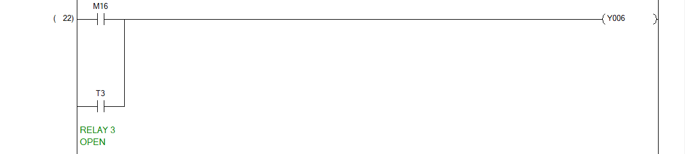
- ##### Lab2 Operation ( 09:00 - 10:00)
    - Math Operation
      - INC / DEC / ADD / SUB / MUL / DIV.
    - Data Operation
      - MOV.
    - Data Compare Operation.
      - AND= , AND<> , AND> , AND< , AND>= , AND<=.
```
File:LAB2
Section Counter Hardware Running
```
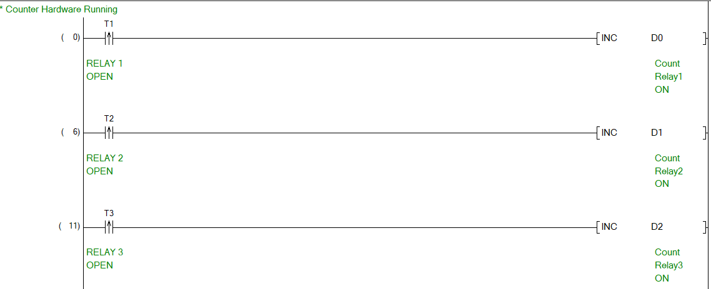
```
File:LAB2
Section Counter Hardware All Reset
```
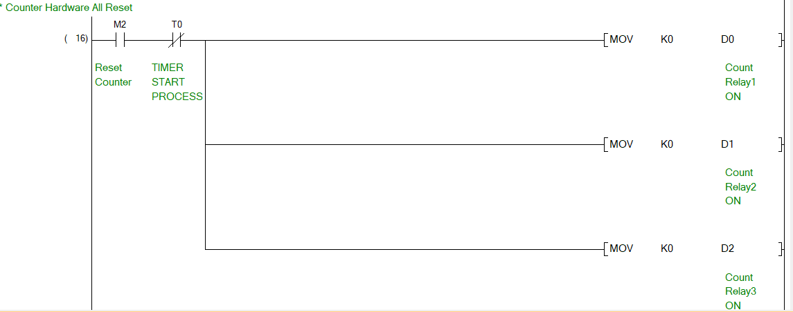
```
File:LAB2
Section Detect Cycle Hardware Maintain
```
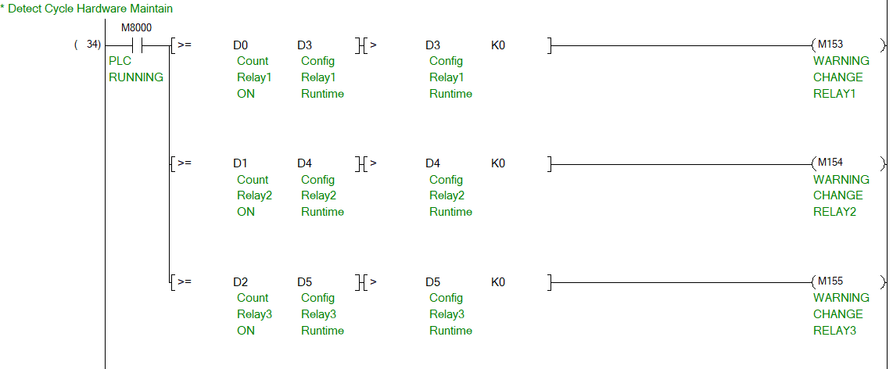
```
File:OUTPUT
```
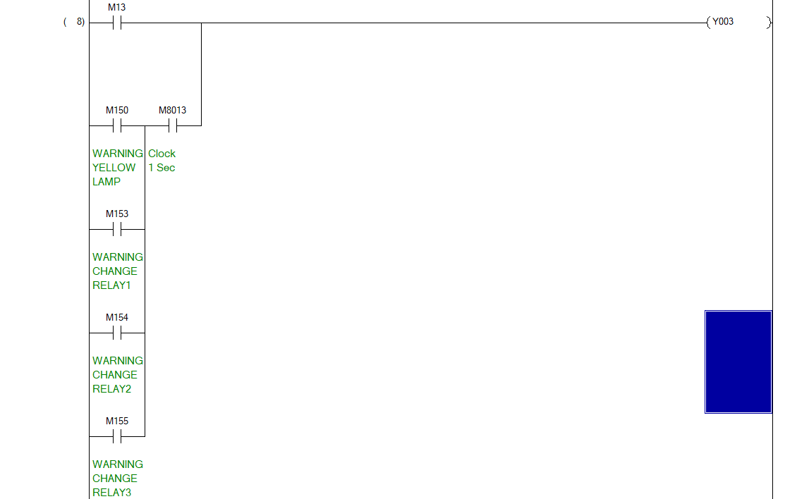
- ##### Guide PLC Memory address ( 10:20 - 11:00)
    - Bit Memory X , Y , M , S.
    - Word Memory D.
    - System Memory D , M.
- ##### How to use analog sensor with plc ( 11:00 - 12:00 )
    - Analog Data.
    - Sensor Temperature and Humidity Scale.
```
File:LAB21
```
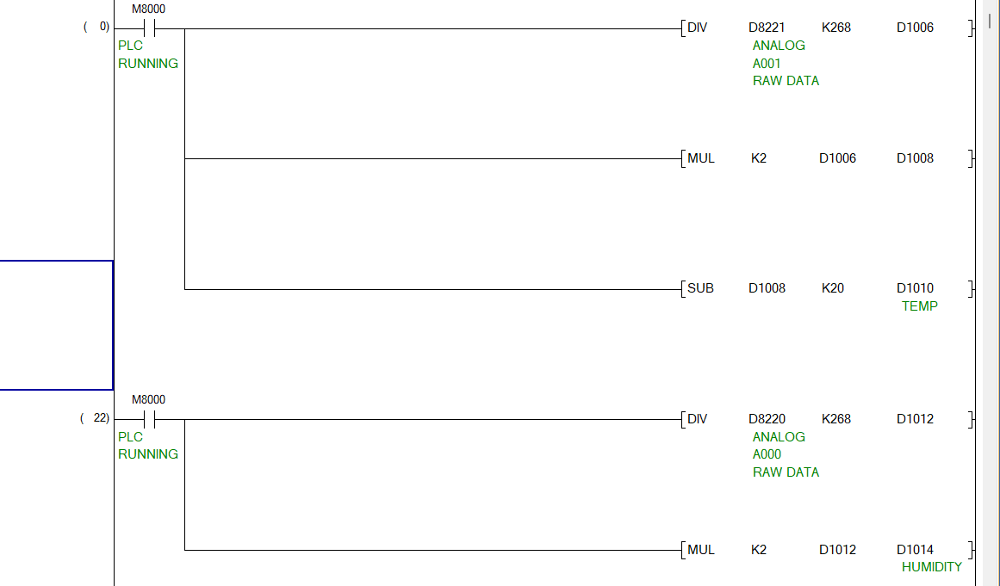
    - Quiz Programming.
- ##### Application Scada system with PLC ( 13:00 - 14:00 )
    - Intro Scada system
      - Supervisor.
      - Control.
      - Data Acquisition.
    - air condition.
      - Cooling Tower.
      - Chiler.
      - Air Handling Unit.
- ##### Lab3 Quiz final ( 14:00 - 17:00 )
---