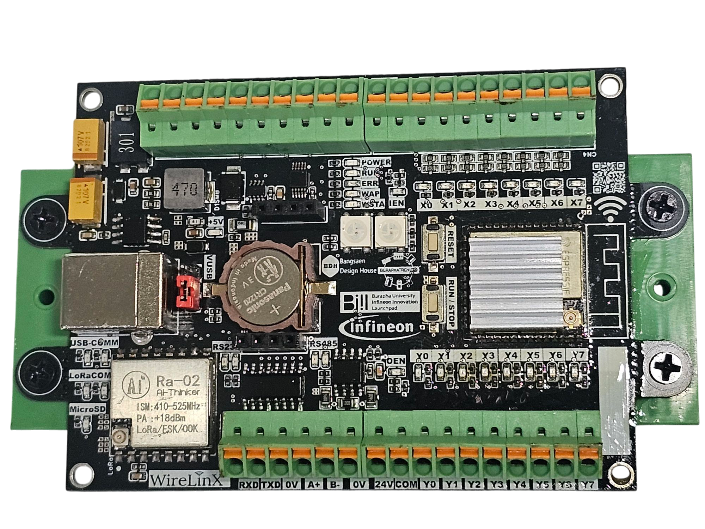
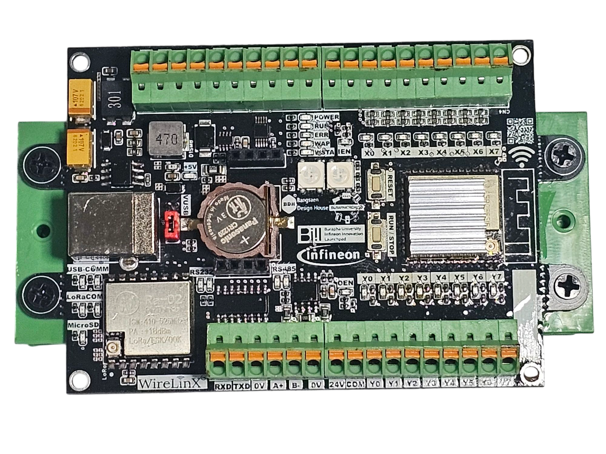

# **WireLinx Programmable Logic Control (PLC) User Manual**

## **Table of Contents**
- **WireLinx Programmable Logic Control (PLC) User Manual**
  - **Table of Contents**
  - [**1. Introduction**](#1-introduction)
    - **Overview of WireLinx PLC**
    - **Key Features**
    - **Applications**
  - [**2. Hardware Specifications**](#2-hardware-specifications)
  - [**3. Getting Started**](#3-getting-started)
    - **Unboxing and Setup**
    - **Connecting Power and Peripherals**
    - **Installing Required Software**
  - [**4. Programming WireLinx PLC**](#4-programming-wirelinx-plc)
    - **Supported Programming Languages**
    - **Using Ladder Logic (LD)**
    - **Configuring the Web Interface**
  - [**5. Communication Protocols**](#5-communication-protocols)
    - **RS-232 and RS-485 Communication**
    -  **Modbus RTU \& Modbus TCP**
    - **Wi-Fi and Web-based Configuration**
  - [**6. Working with I/O**](#6-working-with-io)
  - [**7. Safety and Maintenance**](#7-safety-and-maintenance)
  - [**Training Topics for Basic PLC**](#training-topics-for-basic-plc)
---

## **1. Introduction**
### **Overview of WireLinx PLC**
WireLinx PLC is a programmable logic controller designed for industrial automation and IoT applications. It features a modular and flexible architecture, allowing for seamless integration with existing systems.

### **Key Features**
- **Core Processor:** ESP32-S3 with built-in Wi-Fi
- **Digital Inputs:** Source Type with Isolation
- **Digital Outputs:** Sink Type with Isolation
- **Communication Interfaces:** RS232 , RS485
- **Real-Time Clock (RTC) Support**
- **Web-Based Configuration Interface**
- **Supports Ladder Logic Programming**

### **Applications**
WireLinx PLC can be used in:
- Industrial automation
- Smart building systems
- SCADA & remote monitoring
- Energy management
- IoT & smart agriculture

---

## **2. Hardware Specifications**

| Component               | Specification                    |Unit|
|-------------------------|---------------------------------|---|
| **Processor**          | ESP32-S3                        ||
| **Analog Inputs**     | Analog Voltage Input Resolution 16 Bits    | 4 Points|
| **Digital Inputs**     | 24VDC Source Type    | 8 Points|
| **Digital Outputs**    | 24VDC Sink Type  100 mA/ch   |8 Points|
| **USB**               | USB-Serial Programmable Port   |1 Channel|
| **RS-232**            | 1 Channel Support ASCII , FXCPU ,  ModbusSlave  |1 Channel|
| **RS-485**            | 1 Channel Support ASCII , FXCPU ,  ModbusSlave  |1 Channel|
| **Wi-Fi**             | Support AP and STA Mode by Web Config parameter    ||
| **Real-Time Clock**   | Supported                       ||
| **Input Voltage**     | 12V-24V DC                      ||
| **Power Consumption** | <10W                            ||

---

## **3. Getting Started**
### **Unboxing and Setup**
1. Verify the package contents:
   - WireLinx PLC unit
   - Power adapter
   - User manual
   - Communication cables
2. Inspect the unit for any physical damage.

### **Connecting Power and Peripherals**
- Connect the 12V-24V DC power supply to the PLC.
- Connect I/O modules as needed.
- Use Ethernet, RS-232, or RS-485 for communication.

### **Installing Required Software**
- Download and install **WireLinx IDE**.
- Install additional libraries for C/C++ or Python development.

---

## **4. Programming WireLinx PLC**
### **Supported Programming Languages**
- **IEC 61131-3:** Ladder Logic (LD)
- **Embedded Programming:** C/C++
- **Scripting Languages:** Python

### **Using Ladder Logic (LD)**
- Create rungs to define logical operations.
- Use timers, counters, and mathematical functions.

### **Configuring the Web Interface**
- Access the PLC via Wi-Fi.
- Open the configuration page on a browser.
- Modify network settings, I/O mappings, and debug logs.

---

## **5. Communication Protocols**
### **RS-232 and RS-485 Communication**
- **RS-232:** Used for general-purpose serial communication.
- **RS-485:** Ideal for industrial communication and Modbus RTU.

### **Modbus RTU & Modbus TCP**
- Used for industrial device communication.

### **Wi-Fi and Web-based Configuration**
- Wireless access to PLC settings.
- Remote programming and monitoring.

---
## **6. Working with I/O**
---
## **7. Safety and Maintenance**
---

## **Training Topics for Basic PLC**
1. **Introduction to PLCs**
   - What is a PLC?
   - How PLCs are used in industrial automation
2. **Understanding I/O Types**
   - Digital vs Analog Inputs/Outputs
   - Wiring and Configuration
3. **Ladder Logic Basics**
   - Creating simple logic circuits
   - Using timers and counters
4. **Programming with WireLinx IDE**
   - Writing and deploying programs
   - Debugging tools and monitoring
5. **Communication Protocols**
   - Configuring RS-232 and RS-485
   - Setting up Modbus communication
6. **Web-Based Configuration**
   - Connecting via Wi-Fi
   - Remote setup and diagnostics
7. **Troubleshooting & Maintenance**
   - Common PLC issues and solutions
   - Firmware updates and system diagnostics

---

End of Document.

