# **WireLinx Programmable Logic Control (PLC) User Manual**
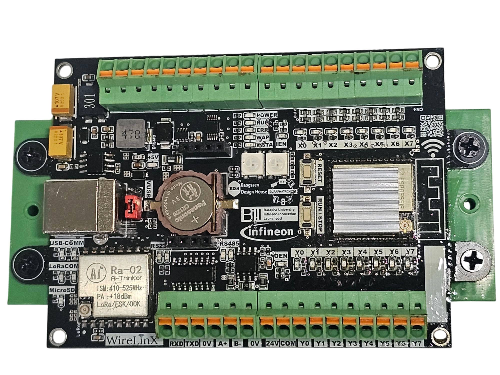

## **Table of Contents**
- **WireLinx Programmable Logic Control (PLC) User Manual**
  - **Table of Contents**
  - [**1. Introduction**](#1-introduction)
    - Overview of WireLinx PLC
    - Key Features
    - Applications
  - [**2. Hardware Specifications**](#2-hardware-specifications)
  - [**3. Getting Started**](#3-getting-started)
    - Installing Required Software
    - Configuring the Web Interfac
  - [**4. Programming WireLinx PLC**](#4-programming-wirelinx-plc)
    - Supported Programming Languages
    - Internal Memory Structure
  - [**5. Communication Protocols**](#5-communication-protocols)
    - Wi-Fi and Web-based Configuration
    - RS-232 and RS-485 Communication
    - Modbus RTU \& Modbus TCP
  - [**6. Working with I/O**](#6-working-with-io)
  - [**7. Safety and Maintenance**](#7-safety-and-maintenance)
  - [**Training Topics for Basic PLC**](#training-topics-for-basic-plc)
---

## **1. Introduction**
### **Overview of WireLinx PLC**
WireLinx PLC is a programmable logic controller designed for industrial automation and IoT applications. It features a modular and flexible architecture, allowing for seamless integration with existing systems.</p>
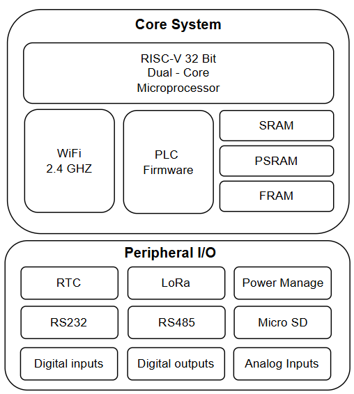</p>
### **Key Features**
- **Core Processor:** ESP32-S3 with built-in Wi-Fi
- **Digital Inputs:** Source Type with Isolation
- **Digital Outputs:** Sink Type with Isolation
- **Communication Interfaces:** RS232 , RS485
- **Real-Time Clock (RTC) Support**
- **Web-Based Configuration Interface**
- **Supports Ladder Logic Programming**

### **Applications**
WireLinx PLC can be used in:
- Industrial automation
- Smart building systems
- SCADA & remote monitoring
- Energy management
- IoT & smart agriculture

---

## **2. Hardware Specifications**


|No.| Component               | Specification                    |Number|
|-|-------------------------|---------------------------------|---|
|| **Processor**          | ESP32-S3                        ||
|1| **Power Suppply**     | DC Voltage 24VDC.     ||
|2| **Analog Inputs**       | Voltage Input 0-10V. Resolution 16 Bits |4 Channels|
|3| **Digital Inputs**     | 24VDC Source Type    | 8 Points|
|4| **Digital Outputs**    | 24VDC Sink Type  100 mA/ch   |8 Points|
|5| **RS-485**            | 1 Channel Support ASCII , FXCPU ,  ModbusSlave  |1 Channel|
|6| **RS-232**            | 1 Channel Support ASCII , FXCPU ,  ModbusSlave  |1 Channel|
|7| **USB**               | USB-Serial Programmable Port   |1 Channel|
|8| **Jumper**               | Switch Select Power Source Terminal / USB   ||
|9| **LoRa extenal antenna** | Support antenna 2.4 GHZ    ||
|10| **Wi-Fi extenal antenna**| Support antenna 433 Mhz    ||
---

## **3. Getting Started**

### **Installing Required Software**
- **Download and install GX-WORK2**

### **Operating Buttons and Status Indicators**
   <p style="text-align: center;">
       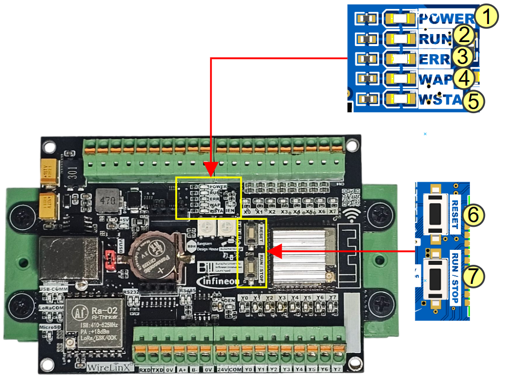
    </p><br>


| **No** |**Type**|**Symbol** | **Status** | **Descriptions**      |
|--------|:-:|:-:|-----------------|----------------|
|1|LED|Power|ON = Power Ready|Indicator power plc ready for use.|
|2|LED|RUN|ON = PLC RUN</p>OFF= PLC STOP|Indicator plc operation status|
|3|LED|ERR|ON = PLC ERROR</p>OFF= NORMAL|Indicator PLC operation abnornal |
|4|LED|WAP|ON = Wifi AccessPoint Enable</p>OFF = Wifi AccessPoint Disable</p>BLINK = Communication Working |Indicator wifi accesspoint status |
|5|LED|STA|ON = Wifi Station Connected</p>OFF = Wifi Station Disconnect</p>BLINK = Communication Working|Indicator wifi accesspoint status|
|6|BUTTON|RESET| Press = RESET PLC | Restart PLC |
|7|BUTTON|RUN/STOP| Press = RUN OR STOP PLC | Run/Stop PLC |

#### **About Button Operation**
- **Reset PLC :** Press for restart all process </p>
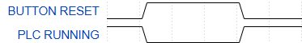
- **Run/Stop PLC :** Press hold 2 sec for switch to toggle before mode.</p>
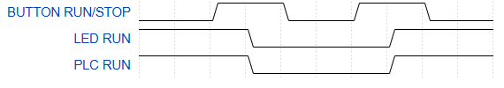

- **Reset parameter config:** Reset Default Parameter config.</p>
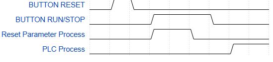

---

## **4. Programming WireLinx PLC**
### **Supported Programming Languages**
- **Ladder Logic**

### **Internal Memory Structure**
| **Memory Type** | **Usage**                                   | **Address Range** | **Capacity**      |
|---------------|------------------------------------------|----------------|----------------|
| **X (Input Relays)**  | Represents physical input points       | X0 - X377  | 256 points     |
| **Y (Output Relays)** | Represents physical output points      | Y0 - Y377   | 256 points     |
| **M (Internal Relays)** | General-purpose internal logic storage | M0 - M3071        | 3072 points    |
| **S (Step Relays)**   | Used for step sequence control        | S0 - S999         | 1000 points    |
| **D (Data Registers)** | Stores numerical values for processing | D0 - D7999        | 8000 words (16-bit each) |
| **D (Data System)** | Stores numerical values for processing | D8000 - D8250        | 251 words (16-bit each) |
| **T (Timers)**        | Used for timing operations            | T0 - T255         | 256 timers     |
| **C (Counters)**      | Used for counting operations          | C0 - C199         | 200 counters   |

##### [See detail About D8000 - D8250](DATASYSTEM.md)

---

## **5. Communication Protocols**

### **Wi-Fi and Web-based Configuration**
- Wireless access to PLC settings.

    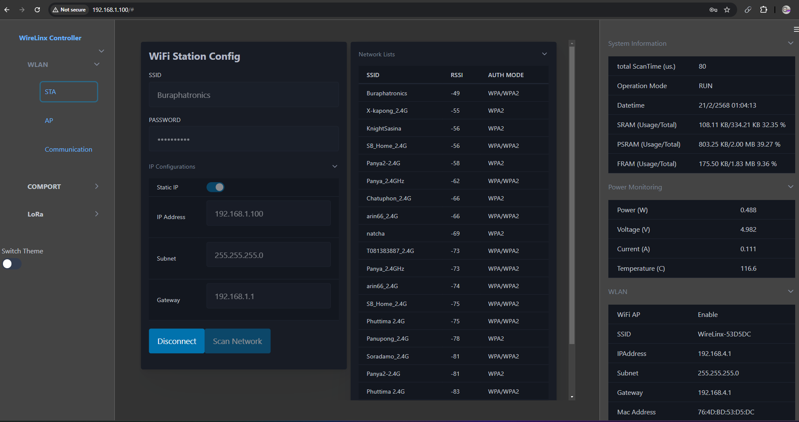
    <br>
- Remote programming and monitoring.

### **RS-232 and RS-485 Communication**
- **RS-232:** Used for general-purpose serial communication.
- **RS-485:** Ideal for industrial communication and Modbus RTU.

### **Modbus RTU & Modbus TCP**
- Table Modbus Address Mapping common with ModbusTCP Server and ModbusRTU Slave Mode.

| **Modbus** |**PLC**| **Type**                  | **Access**  | **Function Code** | **Description**                        |
|-|-|-------------------------|------------|-----------------|------------------------------------|
| **00001 - 01000** |**S0 - S999**| **Coil (Discrete Output)**  | Read/Write  | 01 (Read) / 05, 15 (Write) | Stores ON/OFF values for outputs  |
| **10001 - 11536** |**M1 - M1535**| **Discrete Input**       | Read-only   | 02 (Read)        | Stores ON/OFF values for inputs   |
| **30001 - 33000** |**D0 - 02999**| **Input Register**       | Read-only   | 04 (Read)        | Stores analog input values        |
| **40001 - 43000** |**D3000 - 05999**| **Holding Register**     | Read/Write  | 03 (Read) / 06, 16 (Write) | Stores analog output and parameters |


---
## **6. Working with I/O**
- ### Example input wiring connection

  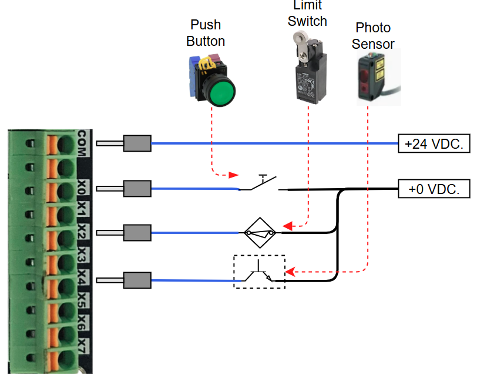
  
- ### Example output wiring connection</p>

    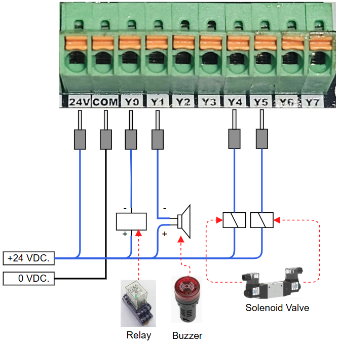

- ### Example analog input wiring connection</p>

    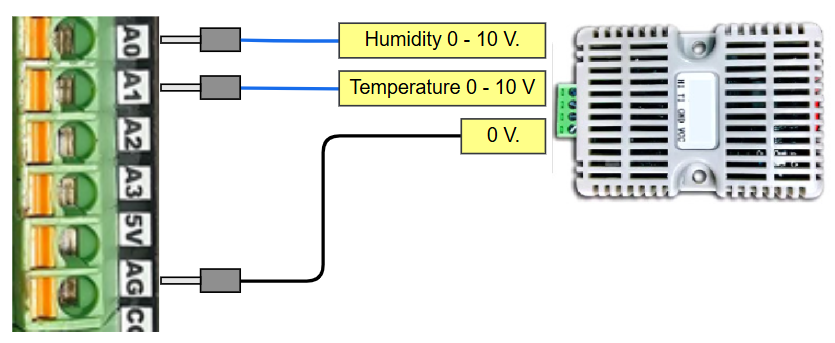</p>

    #### Chart between adc value and voltage value.
    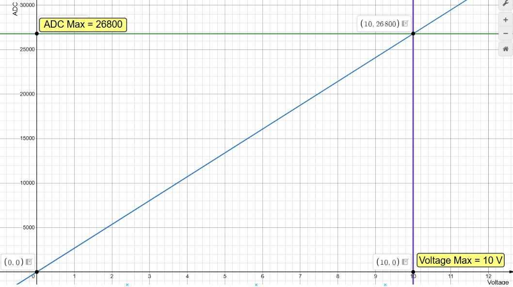</p>

---
## **7. Safety and Maintenance**
---

## **Training Topics for Basic PLC**
### prepare for trainee

- Notebook for training.
- install gx-work2. 
- install ch340 driver. [**Download**](https://wch-ic.com/products/CH340.html)
- drawing training kit. [**Download**](drawing/WireLinx_Station.pdf)

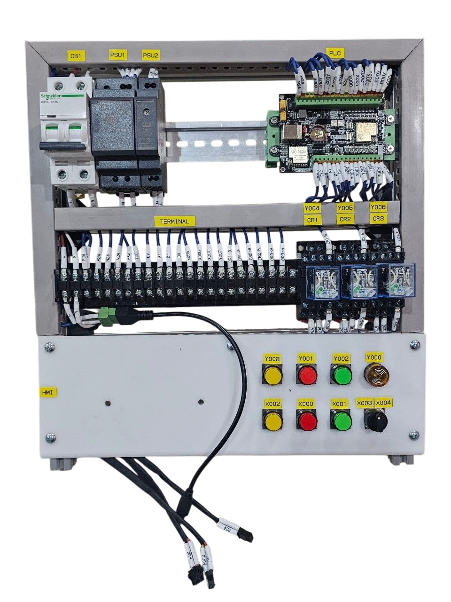
<br><h2>Why need choose PLC.<h2></p>
<p style="text-align: center;">
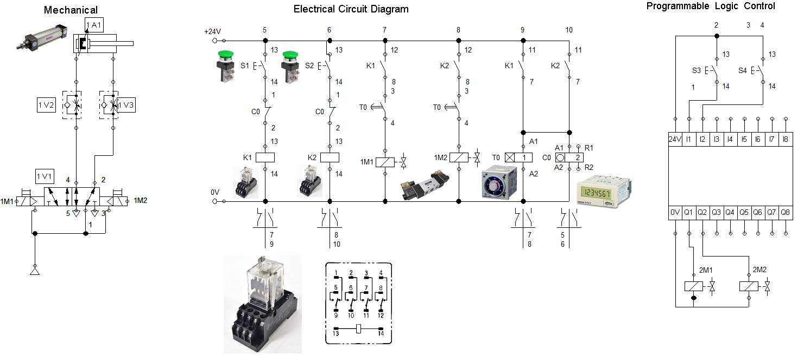
</p>

<br><h2>1.Ladder Logic Basics</h2>
| No.        | Symbol           | Description  |
| :-: |:-| :-----|
| 1 | 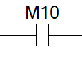 | Contact Normally Open |
| 2 | 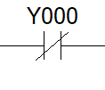 | Contact Normally Close |
| 3 |  |Coil |
| 4 | 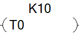|Timer |
| 5 | 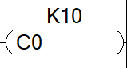|    Counter |
| 6 | 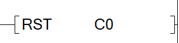|    Instruction Set |

#### How to understand ladder logic.</p>
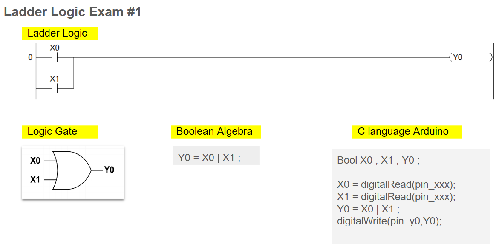</p>
</p>
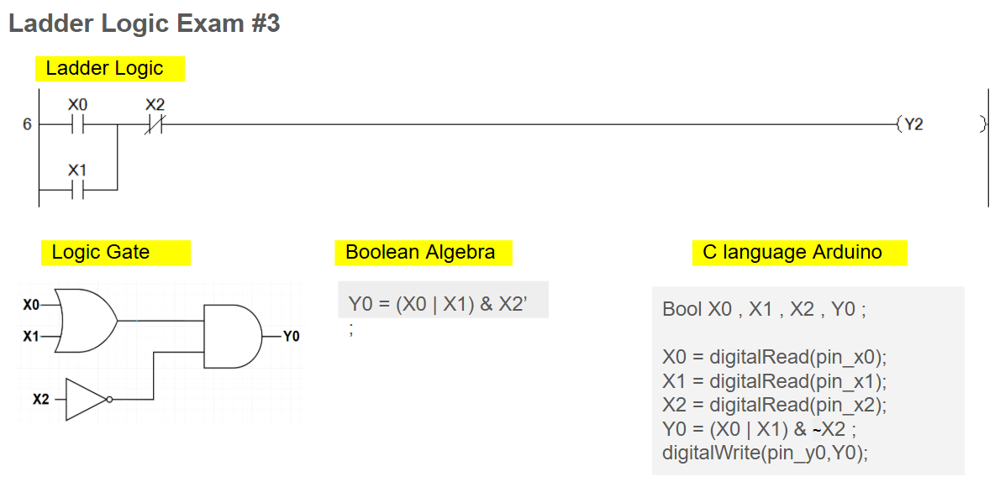</p>
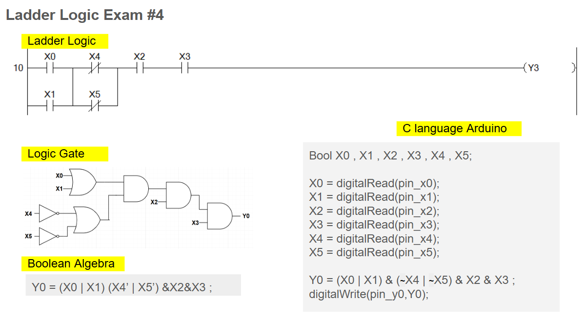
<h2>2. Programming with GX-WORK 2.</h2>
2.1 new project and test connection</p>
<a href="https://youtu.be/2iR9Q22t5_0">
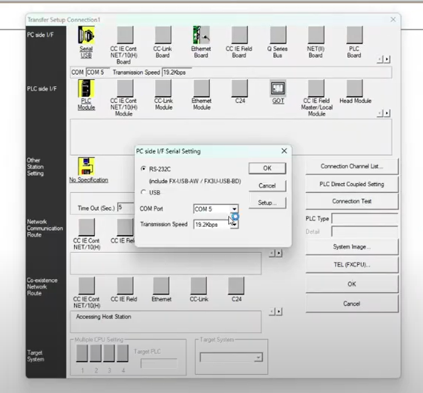
</a>

<br>2.2 download ladder logic to plc.</p>
<a href="https://www.youtube.com/watch?v=Tfad3BvSHQI">
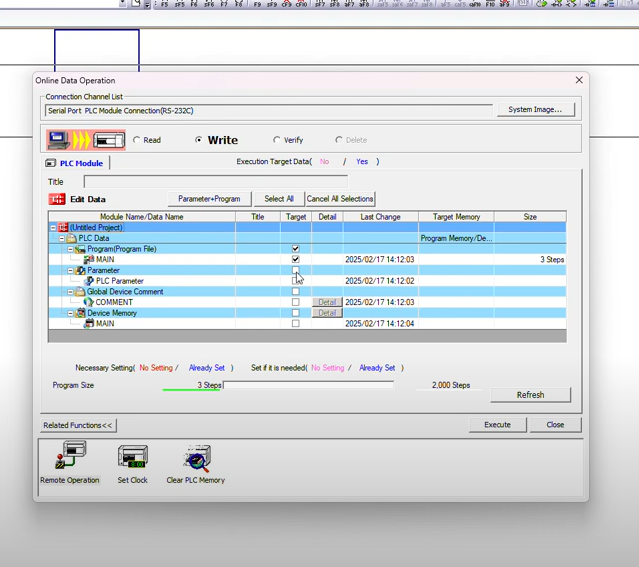
</a>

<br>2.3 upload ladder logic from plc.</p>
<a href="https://www.youtube.com/watch?v=ina59Y-c82w">
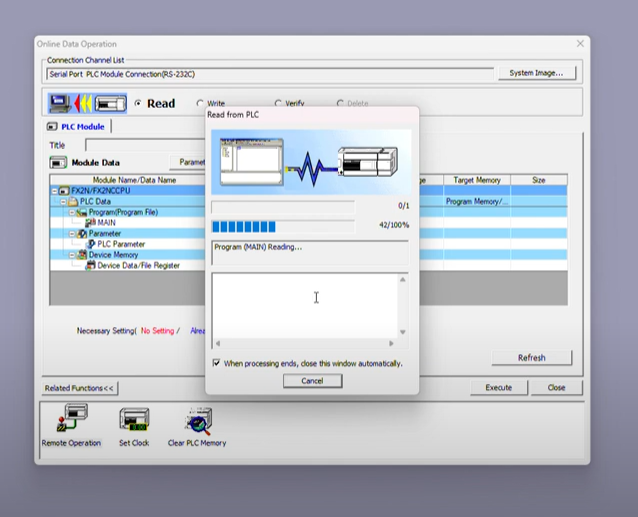
</a>

<br>2.4 monitoring and modify value.</p>
<a href="https://youtu.be/pGsTwQJBvRU">
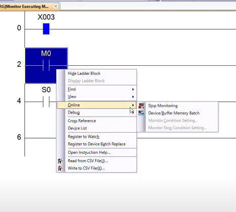
</a>

<h2>3. PLC Basic Programming Exercises .</h2>

```
How to work coil / contact / timer / counter
```
3.1 Create simple ladder logic program to turn on an output when a switch is pressed</br>

```
    Objective : Basic Ladder Logic and applie.
    - Switch Selector X3 make Y0 ON.
    - Press Button X1 make Y2 ON.
    - Press Button X2 make Y3 ON.
```
</p>
</p>
    <p style="text-align: center;">
       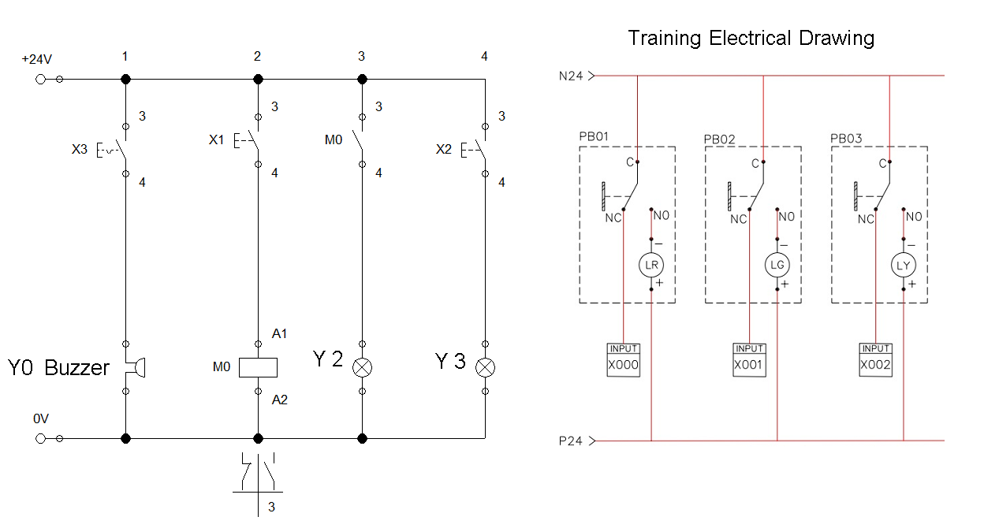
    </p>
    3.2 Write program to self-holding circuit a relay using a start and stop button.</br>

```
    Objective : Convert Electrical circuit to ladder logic.
    - Self hold circuit.
    - interlock coil between Y4 and Y5 for protect load short circuit.
    - Press button X1 make Y4 ON.
    - Press button X2 make Y5 ON.
    - Press button X0 for stop process
``` 
<p style="text-align: center;">
       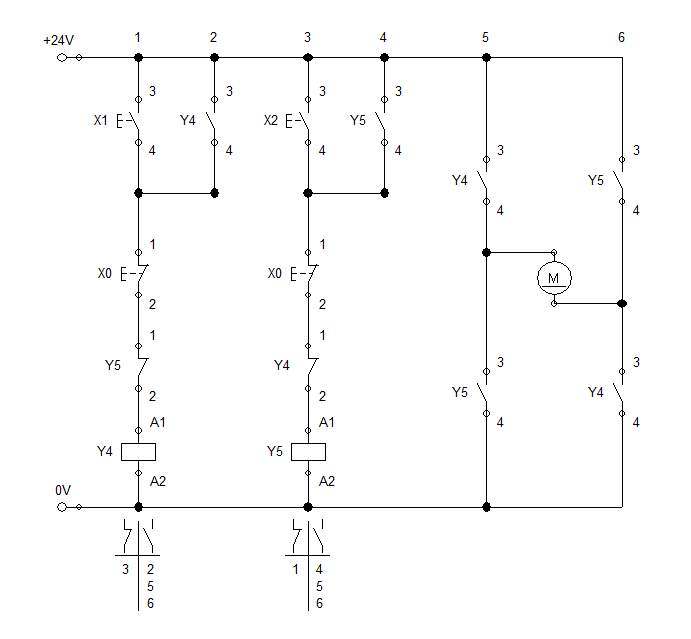
    </p><br>
    3.3 Write timer to turn off relay automatically after a preset time.<p>

```
    Objective : Convert Electrical circuit to ladder logic.
    - Switch X3 for start process.
    - When process start Y3 and Y4 on-off swap indcator inverval 1 sec (Timer1-Timer2)
``` 
<p style="text-align: center;">
       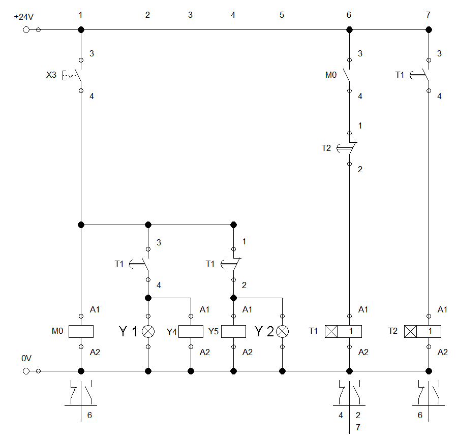
    </p>
    3.4 Write program to counter the number of cycle.</p>

```
    Objective : use timer and counter on ladder logic.
    - Press button X1 for reset counter C0.
    - When C0 on stop process.
```
<p style="text-align: center;">
       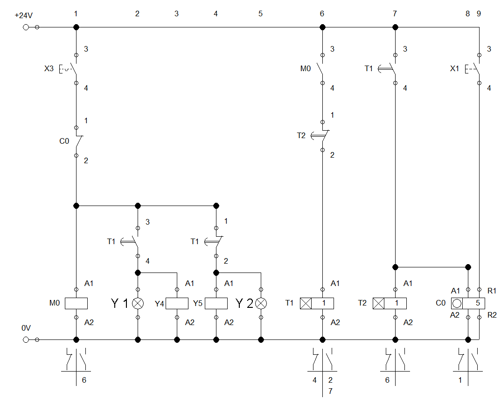
    </p><br>
    3.5 Convert Electrical function process to ladder logic process.<p>

```
    Objective : Convert Electrical circuit to ladder logic.
    - operation 2 mode 
      - mode semi auto  
      - mode auto
```
<p style="text-align: center;">
       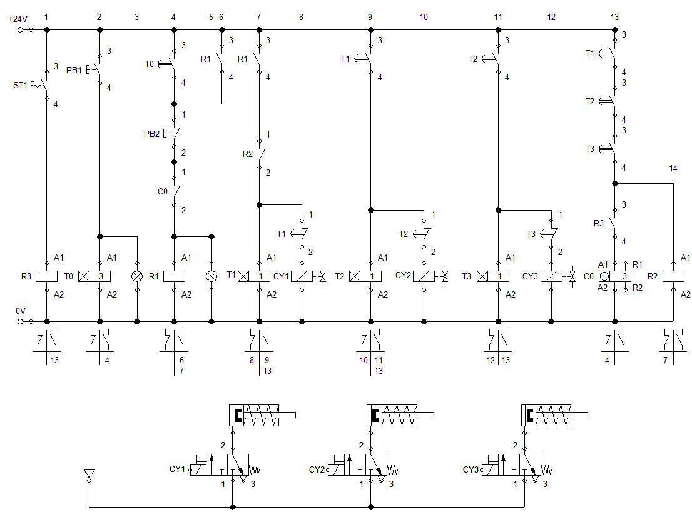
    </p><br>

### 4. **Basic Analog input with Sensor**

```
Objective. 
- Simple Math linear for scale data sensor.
- use Analog Channel A0 and A1.
- use math instruction.
```
</p>
    
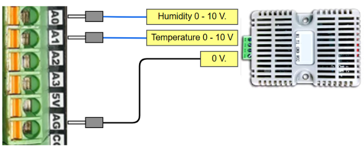</p>

4.1 Understand voltage with temperature and humidity.

|**No**| **Voltage (V)** |**Temperature (C)**| **Humidity (%RH)** |
|:-:|:-:|:-:|:-:|
|1|0|-20|0|
|2|1|-10|10|
|3|2|0|20|
|4|3|10|30|
|5|4|20|40|
|6|5|30|50|
|7|6|40|60|
|8|7|50|70|
|9|8|60|80|
|10|9|70|90|
|11|10|80|100|

4.2 Plot chart between Temperature and voltage.


```
find slope equation from parameter.
Axis Y  ==> Tmin = -20 , Tmax = 80c.
Axis X  ==> Vmin = 0 , Vmax = 100.  (* note Voltage input = Vmax*0.1 )

from Y = MX + C  by  M = dy/dx = (Tmax-Tmin)/(Vmax - VMin) + Tmin
                     M = ( 80 - (-20) )/( 100 - 0 )
                     M = 1
                     C = -20
  
Eq1. Temperature = Voltage - 20

and convert from adc value input to voltage input.

Eq2. Voltage = ( adc_raw / 268 )

Move Voltage from Eq2 to Eq1.

Summary
Temperature = ( adc_raw / 268 ) - 20  <<---- Write Ladder Compute this.
    

```
4.3 Plot chart between Humidity and voltage.


### 5. **Communication Protocols**
   - Configuring RS-232 and RS-485
   - Setting up Modbus communication

### 6. **Web-Based Configuration**
   - Connecting via Wi-Fi
   - Remote setup and diagnostics

### 7. **Troubleshooting & Maintenance**
   - Common PLC issues and solutions
   - Firmware updates and system diagnostics

---

End of Document.

