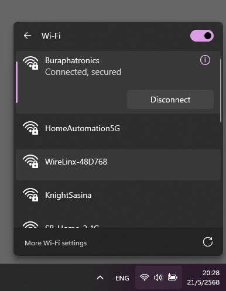
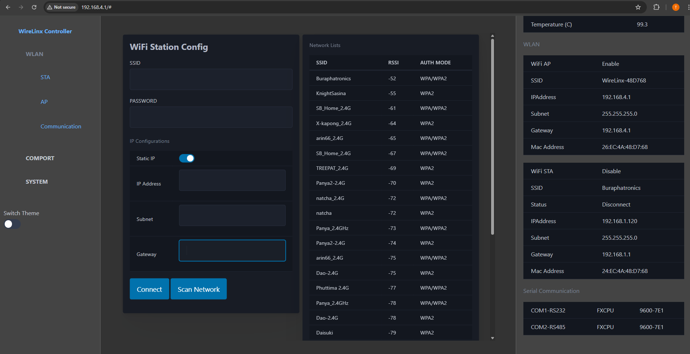
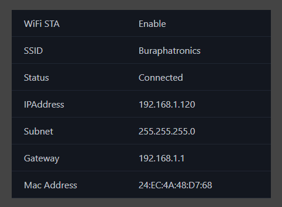

# WiFi STA Connection.
#### 1. Connect WiFi AccessPoint "WireLinx-XXXXX"

```
Example. Insert default Password by 'XXXXX' is '48D768'
WiFi Passsword = WireLinx-48D768
```


---

#### 2. Access WebConfig
```
Default IP = 192.168.4.1
Username = admin
Password = 1234
```


---

#### 3. Access Page "STA"
```
Insert STA Parameter
3.1 insert SSID
3.2 insert PASSWORD
3.3 insert Static Address Enable/Disable
3.4 insert IPAddress
3.5 insert Subnet
3.6 insert Gateway
3.4 Click "Connect"
```


---

#### 4. Check Station Connection
